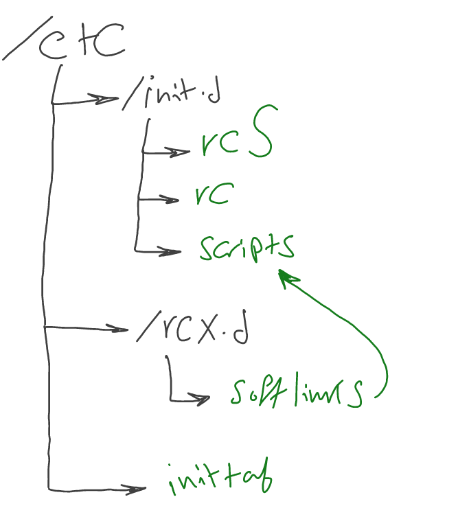

# Init process
>Source: Mastering Embedded Linux Programming 3rd edition

When Kernel is loaded and running we see that it looks for the rootfs and then it starts to execute the init process in `/sbin/init`. The kernel command line should have:

`root=` & `init=` To identify the rootfs and init locations 

The init program has root
privilege, and since it is the first process to run, it has a process ID (PID) of 1. If, for some
reason, init cannot be started, the kernel will panic.

```bash
# To show the processes hierarchy
pstree
```

The job of the init program is to take control of the boot process in user space and set
it running. In other words, init manages the life cycle of the system from bootup to shutdown.
## Busybox Init

The Busybox init is the simplest one. it contain a minimal `init program` that uses configuration from `/etc/inittab` file. It will execute scripts in `/etc/init.d` directory

The inittab format is as follow:
```bash
<id>::<action>:<program>
```
**Actions:**
- `sysinit:` Runs the program when init starts before any other types of actions

- `respawn:` Runs the program and restarts it if it terminates. It is typically used to
run a program as a daemon.

- `askfirst:` his is the same as respawn, but it prints the message Please
press Enter to activate this console to the console, and it runs the
program after Enter has been pressed. It is used to start an interactive shell on
a terminal without prompting for a username or password.

- `wait:` Runs the program and waits for it to complete.

- `once:` Runs the program and doesnt restart it if terminated

**Simple example:**
```bash
null::sysinit:/bin/mount -t proc proc /proc
null::sysinit:/bin/mount -t sysfs sysfs /sys
console::askfirst:-/bin/sh
```

### Buildroot init scripts
Buildroot has been making effective use of BusyBox init for many years. Buildroot has
two scripts in `/etc/init.d/` named `rcS` and `rcK`. The first one runs at bootup and
iterates over all the scripts in `/etc/init.d/` with names that begin with a *capital S*
followed by two digits, and runs them in numerical order. These are the start scripts. The
`rcK` script is run at shutdown and iterates over all the scripts beginning with a *capital K*
followed by two digits and runs them in numerical order. These are the kill scripts.

## System V
This is the very first init process that was introduced in Unix system. Was the most popular until recently it got replaced by `systemd` 

SystemV has the concept of `runlevels` which allow to run and stop collection of scripts when changing from runlevel to another

There are eight runlevels, numbered from 0 to 6, plus S:
- S: Runs startup tasks
-  0: Halts the system
- 1 to 5: Available for general use
- 6: Reboots the system

Levels 1 to 5 can be used as you please. On desktop Linux distributions, they are
conventionally assigned as follows:
- 1: Single user
- 2: Multi-user without network configuration
- 3: Multi-user with network configuration
- 4: Not used
- 5: Multi-user with graphical login

The default runlevel is specifed in inittab as follows
```bash
id:3:initdefault:

# Format
id:runlevels:action:process
```
- id: A unique identifier of up to four characters.
- runlevels: The runlevels for which this entry should be executed. **This was left
blank in the BusyBox inittab.**

### inittab 
You will need to add these configuration in inittab to implement your handling script for changing runlevels
```
l0:0:wait:/etc/init.d/rc 0
l1:1:wait:/etc/init.d/rc 1
l2:2:wait:/etc/init.d/rc 2
l3:3:wait:/etc/init.d/rc 3
l4:4:wait:/etc/init.d/rc 4
l5:5:wait:/etc/init.d/rc 5
l6:6:wait:/etc/init.d/rc 6
```
### Directory structure
**NOTE:** You will need to implement the following structure 



The softlinks will be named either Sxxname or Kxxname to indicate for the rc either to kill or start these scripts

### Adding new daemon
See the systemV directory for the scripts. The `simpleserver` is the daemon and `rc` is the handling script.

```bash
cd /etc/rc5.d
ln -s /etc/init.d/simpleserver S01simpleserver
```

**NOTE:** Daemons is automatically killed when changing runlevels if not specifed 

## Systemd

