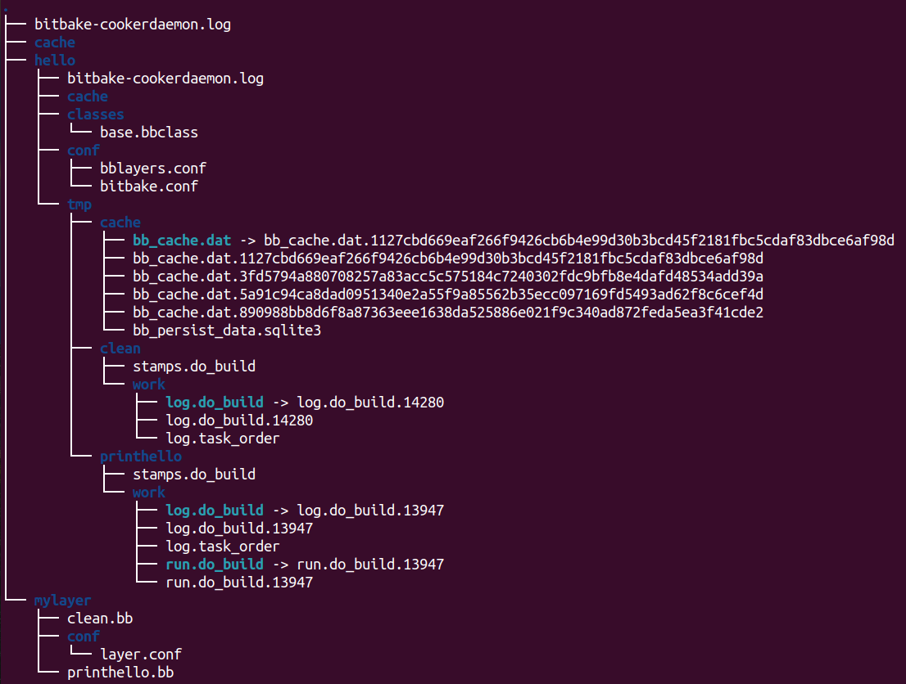

# Yocto


## Bitbake 
We will be creating a hello world example to understand how bitbake work.

> **Source:** https://docs.yoctoproject.org/bitbake/2.4/bitbake-user-manual/bitbake-user-manual-hello.html


### Understanding the results

1. The `BBPATH` environment variable states the build directory
2. `hello/conf/bitbake.conf: ` 
    - This file is the first thing BitBake must find in order to build a target
    - includes a number of configuration variables BitBake uses for metadata and recipe files
    ``` makefile
    # file: bitbake.conf

    PN  = "${@bb.parse.vars_from_file(d.getVar('FILE', False),d)[0] or 'defaultpkgname'}"

    TMPDIR  = "${TOPDIR}/tmp"
    CACHE   = "${TMPDIR}/cache"
    STAMP   = "${TMPDIR}/${PN}/stamps"
    T       = "${TMPDIR}/${PN}/work"
    B       = "${TMPDIR}/${PN}"
    ```
    > You can always safely delete the tmp directory in order to rebuild a BitBake target. The build process creates the directory for you when you run BitBake.

3. `hello/classes/base.bbclass`
    - BitBake uses class files to provide common code and functionality. The minimally required class for BitBake is the classes/base.bbclass file.
    - The base class is implicitly inherited by every recipe. BitBake looks for the class in the classes directory of the project (i.e hello/classes in this example).
    ``` make
    # file: base.bbclass

    addtask build
    ```
    - This will need to run **do_build()** task that you must include in your recipe

4. `layers`
    - Directory containing grouped metadata (Usually starts with "meta-")
    - Minimally, you need a recipe file and a layer configuration file in your layer. The configuration file needs to be in the conf directory inside the layer.
    ``` make
    # file: mylayer/conf/layer.conf

    BBPATH .= ":${LAYERDIR}"
    BBFILES += "${LAYERDIR}/*.bb"
    BBFILE_COLLECTIONS += "mylayer"
    BBFILE_PATTERN_mylayer := "^${LAYERDIR_RE}/"
    LAYERSERIES_CORENAMES = "hello_world_example"
    LAYERSERIES_COMPAT_mylayer = "hello_world_example"
    ```

    ``` python
    # file: mylayer/printhello.bb

    DESCRIPTION = "Prints Hello World"
    PN = 'printhello'
    PV = '1'

    python do_build() {
    bb.plain("********************");
    bb.plain("*                  *");
    bb.plain("*  Hello, World!   *");
    bb.plain("*                  *");
    bb.plain("********************");
    }
    ```
5. `hello/conf/bblayers.conf`
    - Locate layers needed for the project. This file must reside in the conf directory of the project (i.e. hello/conf for this example).
    ```
    BBLAYERS ?= " \
    /home/taqi/yocot_playground/mylayer \
    "
    ```
6. Finally you can run bitbake to build your system

    ``` bash
    bitbake printhello
    ```

**NOTE:** After the first execution, **re-running bitbake printhello again will not result in a BitBake run that prints the same console output**. The reason for this is that the first time the printhello.bb recipe’s do_build task executes successfully, **BitBake writes a stamp file for the task**. Thus, the next time you attempt to run the task using that same bitbake command, BitBake notices the stamp and therefore determines that the task does not need to be re-run. **If you delete the tmp directory or run bitbake -c clean printhello and then re-run the build, the “Hello, World!” message will be printed again.**


``` bash
# Show layers in current build
bitbake-layers show-layers
```

### Dircetory structure

