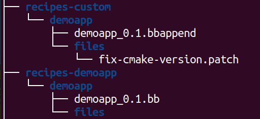
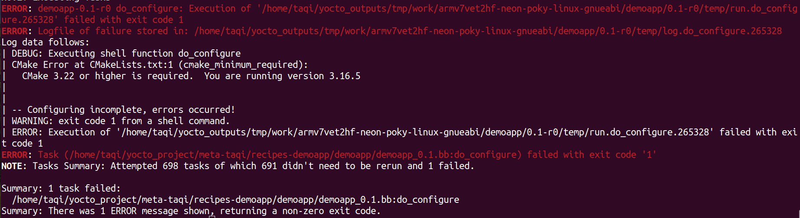

# Patch file
In yocto we may find a recipe that we need to edit and use it. To make such thing it is not recommended to edit the provided recipe directly instead use patch and bbappend files.

bbappend file is just an extention to an already existed recipe that you want to edit

## Steps
1. Make the necessary edits in the source code and use the following command
    ```shell
    git diff source.c > fix-somthing.patch
    ```
2. Make a custom recipe directory / or layer if needded 
    

3. Add your patch file in the files directory within the recipe

4. Build your image again and check 

> NOTE: the bbappend file must be of the same name of the recipe one -the bb file-

## Example
we have a demo app in github: https://github.com/FadyKhalil/DemoApp

1. Make a recipe to fetch and compile and install it in your image
    
    You will notice that it requires a different version of cmake than what we have in yocto

2. Apply necessary fix (patch) to it, Just change the required cmake version from the CMakeLists.txt

3. Use diff command to generate the patch file
    ```shell
    git diff CMakeLists.txt > fix-cmake-version.patch
    ```
4. Add your new recipe that will contain both the .bbappend and .patch files

5. Build your image again 