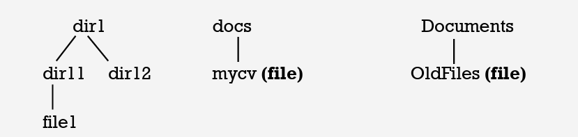

# Day_1 Task

## Q1- List Three Linux Distros

1- Debian
2- Fedora
3- Ubuntu
4- Red hat

## Q2- From the slides what is the **man** command used for?

man command is used to display the user manual for a command

## Q3- What is the difference between rm and rmdir using man command? 

### rm:
(rm - remove files or directories)
This command can be used to remove a file or directory from the file system

### rmdir
(rmdir - remove empty directories)
This command is used only to remove empty directories

## Q4- Create the following hierarchy under your home directory: 

## a. Remove dir11 with rmdir in one-step. What did you notice? And how did you overcome that?  

```bash
rmdir dir11
```
You cant remove a non-empty directory wiht rmdir. Therefore use rm -r instead

```bash
rm -r dir11
```


## b. Then remove OldFiles using rmdir –p command. State what happened to the hierarchy (Note: you are in your home directory).  
From the user manual:

**-p, --parents**
    remove DIRECTORY and its ancestors; e.g., 'rmdir -p a/b/c' is similar to 'rmdir a/b/c a/b a'

This command cannot delete the Documnets directory as it is not empty!

## c. The output of the command pwd was /home/user. Write the absolute and relative path for the file mycv  
**Absolute:**

/home/user/docs/mycv

**Relatile:**

/docs/mycv

## Q5- Copy the /etc/passwd file to your home directory making its name is mypasswd 

```bash
cp /etc/passwd mypasswd
```

## Q6- Rename this new file to be oldpasswd  

```bash
mv mypasswd oldpasswd
```

## Q7- You are in /usr/bin, list four ways to go to your home directory 

```bash
cd 
cd ~
cd /home/user-name
cd ../../home/user-name
```

## Q8- List Linux commands in /usr/bin that start with letter w 

```bash
ls /usr/bin | grep '^w'

ls /usr/bin/w*
```

## Q9- What command type are used for? (from the slide) 

Display information about command type

## Q10- Show 2 types of command file in /usr/bin that start with letter c 

## Q11- Using man command find the command to read file. (Note: man take option)

```bash
man -k readfile
```

## Q12- What is the usage of apropos command? 

apropos - search the manual page names and descriptions
