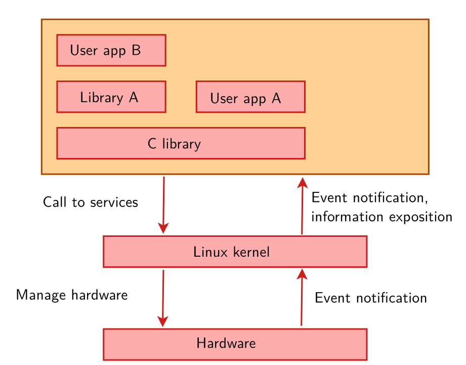

# Linux Kernel

The Linux kernel is the core component of the Linux operating system, responsible for managing system resources such as memory, processes, input/output (I/O), and device drivers. It is an open-source software project that was initially developed by Linus Torvalds in 1991 and is now maintained by a large community of developers around the world.

> Useful website to browse linux: https://elixir.bootlin.com





``` bash
# Clone the Linux Kernel
git clone https://github.com/torvalds/linux.git --depth=1

# List all available configs for your arch
make ARCH=arm help

#configure the kernel to vexpress
make ARCH=arm CROSS_COMPILE=<Yours> vexpress_defconfig

# To indentify your kernel version 
make ARCH=arm ROSS_COMPILE=<Yours> 
kernelversion

#configure the kernel with the configuration discuss above
make ARCH=arm CROSS_COMPILE=<Yours> menuconfig

# You can also use graphical interface QT based But will need to install QT
sudo apt install qtbase5-dev
make ARCH=arm CROSS_COMPILE=<Yours> xconfig

#build the kernel (-j4 specifies 4 jobs to run in parallel)
make -j4 zImage modules dtbs

```
> Output will be in arch/arm/boot 

### Kernel compilation results

- arch/\<arch>/boot/Image, uncompressed kernel image that can be booted
- arch/\<arch\>/boot/\*Image*, compressed kernel images that can also be booted
- bzImage for x86, zImage for ARM, Image.gz for RISC-V, vmlinux.bin.gz for ARC,
etc.
- arch/\<arch\>/boot/dts/*.dtb, compiled Device Tree Blobs
- All kernel modules, spread over the kernel source tree, as .ko (Kernel Object) files.
- vmlinux, a raw uncompressed kernel image in the ELF format, useful for
debugging purposes but generally not used for booting purposes

**NOTE:** Kernel Will Panic since you didnt create the rootfs

## Configure Kernel

For all the next board this configuration must be checked

- [ ] Enable **devtmpfs**
- [ ] Change kernel compression to **XZ**
- [ ] Change your kernel local version to your name and append on it **yourName**-v1.0


```bash
# If you want to save a configuration you made
make savedefconfig
mv defconfig arch/<arch>/configs/myown_defconfig

# Now you can build your own defconfig
make myown_defconfig
```