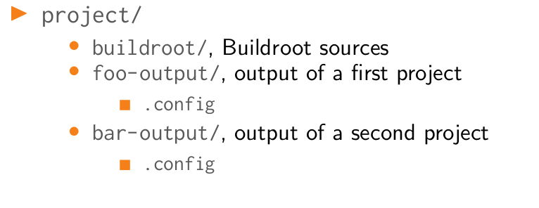
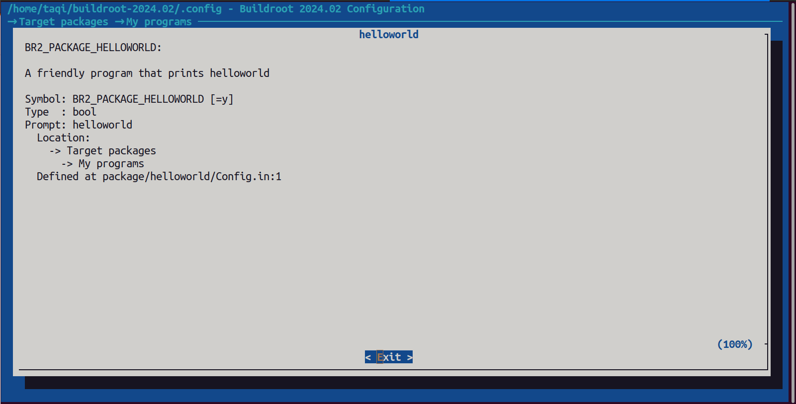

# Buildroot

> sources: Mastering Embedded Linux Programming 3rd edition; Bootlin

The current versions of Buildroot are capable of building a toolchain, a bootloader, a kernel,
and a root filesystem. It uses GNU Make as the principal build tool. There is good online
documentation at https://buildroot.org/docs.html, including The Buildroot user
manual at https://buildroot.org/downloads/manual/manual.html.

## Introduction

Buildroot is a popular buildsystem for embedded linux applications, It is capable of building the four elements of embedded linux: `toolchain` , `Bootloader`, `Kernel`, `root files system`.

Buildroot was one of the first build systems. It began as part of the uClinux and uClibc
projects as a way of generating a small root filesystem for testing.

As a matter of interest, Buildroot is also the ancestor of another popular build system,
`OpenWrt` (http://wiki.openwrt.org), which forked from Buildroot around
2004. The primary focus of OpenWrt is to produce software for wireless routers, and so
the package mix is oriented toward the networking infrastructure.

**Popular Companies using buildroot:**
- Space X
- Tesla
- Microship

## Configuration

We will build for QEMU which is `qemu_arm_versatile_defconfig` config

```  bash
make list-defconfigs

make qemu_arm_versatile_defconfig

make menuconfig

make

```

> Customization of the output directory done by passing O=/path/to/directory on the command line.

``` bash
make O=../foo-output/ menuconfig
```

## Adding Your Own Package 

**What will you need:**

-  A directory, package/foo
-  A Config.in file, written in kconfig language, describing the configuration options
for the package.
- A \<pkg>.mk file, written in make, describing where to fetch the source, how to
build and install it, etc.
- An optional \<pkg>.hash file, providing hashes to check the integrity of the
downloaded tarballs and license files.
- Optionally, .patch files, that are applied on the package source code before
building.
- Optionally, any additional file that might be useful for the package: init script,
example configuration file, etc.


**Preparing your package structure:**
```bash
mkdir package/helloworld
cd package/helloworld

vim Config.in
vim helloworld.mk

mkdir src

cd src  

vim helloworld.c
vim Makefile
```

### Config.in

This is the configuration file read by buildroot, where it contains desription for this package and how it will be chosen by the user.

1. Make the Config.in in the package directory

```bash
config BR2_PACKAGE_HELLOWORLD
    bool "helloworld"
    help
        A friendly program that prints helloworld
```

**NOTE:** it must be named BR2_PACKAGE_YOURPACKAGE

**NOTE:** All package/\<pkg>/Config.in files are included from package/Config.in.

2. Add your package Config.in to the main packages Config.in to be visible in buildroot

```bash
.
.
.

menu "My Programs"
    source "package/helloworld/Config.in"
endmenu
.
.
.
```

### helloworld.mk

``` bash
HELLOWORLD_VERSION = 1.0.0
HELLOWORLD_SITE = pacakge/helloworld/src
HELLOWORLD_SITE_METHOD = local

define HELLOWORLD_BUILD_CMDS
    $(MAKE) CC="$(TARGET_CC)" LD="$(TARGET_LD)" -C $(@D)
endef
```

### src directory


#### helloworld.c

Add whatever you like

#### Makefile

This will be used to build and the src files you want
``` Makefile
.PHONY: clean
.PHONY: helloworld

helloworld: helloworld.c
	$(CC) -g -Wall $(CFLAGS) $(LDFLAGS) $< -o $@

clean:
	-rm helloworld
        
#### NOTE: Makefile requires a tab character for indentation. Spaces will not work. ####
```

### The result 


After using make, Buildroot will build your package and add it to /usr/bin

