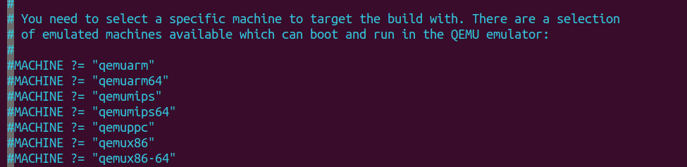

# Building your image
>Source: https://docs.yoctoproject.org/2.5/mega-manual/mega-manual.html.  And Mastering Embedded Linux programming 3rd edition

To build your image you will need to initialise your building environment 

``` bash
sorce oe-init-build-env <your_directory>
```

Initially, the build directory contains only one subdirectory named `conf/`, which
contains the following configuration files for this project:
- `local.conf:` This contains a specification of the device you are going to build and
the build environment.
- `bblayers.conf:` This contains the paths of the meta layers you are going to use. I
will describe layers later on.


## QEMU

In `conf/local.conf` You can choose the MACHINE you want to build. Just uncomment for example `qemuarm`


You also will see that this config file has a default MACHINE: `MACHINE ??= qemux86-64` This ??= means it can be overriden

Check what layers are depending on from `bblayers.conf`

OR
```bash
bitbake-layers show-layers
```

Now just build your image using `bitbake`
```bash
bitbake core-image-minimal
```

- `core-image-minimal:` This is a small console-based system that is useful for
tests and as the basis for custom images.
- `core-image-minimal-initramfs:` This is similar to core-image-
minimal but built as a ramdisk.
- `core-image-x11:` This is a basic image with support for graphics through an X11
server and the xterminal Terminal app.
- `core-image-full-cmdline:` This console-based system offers a standard CLI
experience and full support for the target hardware.


After building your image, `Downloads` `tmp` `sstate-cache` directories will be generated

`tmp` will contain:
- `work/`: This contains the build directory and the staging area for the root filesystem.
- `deploy/`: This contains the final binaries to be deployed on the target:
    - `deploy/images/[machine name]/:` Contains the bootloader, the kernel
and the root filesystem images ready to be run on the target.
    - `deploy/rpm/: `This contains the RPM packages that make up the images.
    - `deploy/licenses/:` This contains the license files that are extracted from
each package

To run your QEMU image 

```
runqemu qemuarm
```

## Raspberry Pi 4

### 1- Download the RPI4 layer
> https://git.yoctoproject.org/meta-raspberrypi


### 2- Check the dependencies of this layer


```bash
# README.md
.
.
.

This layer depends on:

URI: git://git.yoctoproject.org/poky

branch: master
revision: HEAD
URI: git://git.openembedded.org/meta-openembedded

layers: meta-oe, meta-multimedia, meta-networking, meta-python
branch: master
revision: HEAD
.
.
.
```

**Therefore you will need to download meta-openembedded and poky ofcourse**

### 3- Add the dependent layers to the bblayers.conf
```
BBLAYERS ?= " \
  /home/taqi/poky/meta \
  /home/taqi/poky/meta-poky \
  /home/taqi/poky/meta-yocto-bsp \
  /home/taqi/meta-raspberrypi \
  /home/taqi/meta-openembedded/meta-oe \
  /home/taqi/meta-openembedded/meta-python \
  /home/taqi/meta-openembedded/meta-networking\
  /home/taqi/meta-openembedded/meta-multimedia \
  "
```

### 4- Add the machine name raspberrypi4-64 to local.conf
```
.
.
MACHINE ?= "raspberrypi4-64"
.
.
```
You may ask how did we know the name of the machine?

- Go to meta-raspberrypi/conf/machine

You will see the supported machines by this layer.

### 5- Add extra packages you want in local.conf if needed

```bash
CORE_IMAGE_EXTRA_INSTALL += "openssh python3-termcolor"
```
> This will install openssh and color your terminal

**NOTE:** 
- openssh is part of the `meta-openembedded/meta-oe`
- python3-termcolor is part of `meta-openembedded/meta-python`

### 6- Finally build your image
```
bitbake core-image-minimal
```
> After this the file you want to format on your SD card will be in tmp/deploy/images/<yours>/*.wic.bz2


### SSH from laptop to RPI4 with ethernet
Make sure your ethernet interface has an IP on your laptop and other IP on your RPI4

```bash
# -b will specify the IP you want to use when SSH
ssh -b 192.168.1.151 root@192.168.1.150
```

## Check any environment variable 
``` bash
# Check for any variable starts with MACHINE 
 bitbake -e core-image-minimal | grep ^MACHINE
```