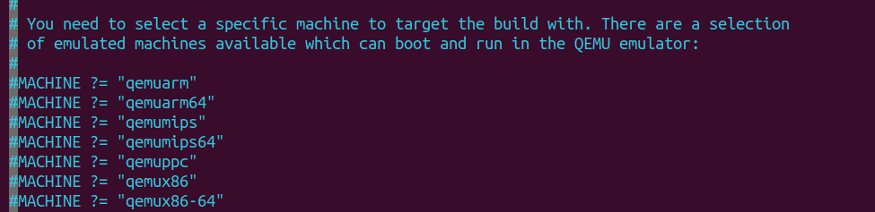

# Building your image
>Source: https://docs.yoctoproject.org/2.5/mega-manual/mega-manual.html.  And Mastering Embedded Linux programming 3rd edition

To build your image you will need to initialise your building environment 

``` bash
sorce oe-init-build-env <your_directory>
```

Initially, the build directory contains only one subdirectory named `conf/`, which
contains the following configuration files for this project:
- `local.conf:` This contains a specification of the device you are going to build and
the build environment.
- `bblayers.conf:` This contains the paths of the meta layers you are going to use. I
will describe layers later on.


## QEMU

In `conf/local.conf` You can choose the MACHINE you want to build. Just uncomment for example `qemuarm`


You also will see that this config file has a default MACHINE: `MACHINE ??= qemux86-64` This ??= means it can be overriden

Check what layers are depending on from `bblayers.conf`

OR
```bash
bitbake-layers show-layers
```

Now just build your image using `bitbake`
```bash
bitbake core-image-minimal
```

- `core-image-minimal:` This is a small console-based system that is useful for
tests and as the basis for custom images.
- `core-image-minimal-initramfs:` This is similar to core-image-
minimal but built as a ramdisk.
- `core-image-x11:` This is a basic image with support for graphics through an X11
server and the xterminal Terminal app.
- `core-image-full-cmdline:` This console-based system offers a standard CLI
experience and full support for the target hardware.


After building your image, `Downloads` `tmp` `sstate-cache` directories will be generated

`tmp` will contain:
- `work/`: This contains the build directory and the staging area for the root filesystem.
- `deploy/`: This contains the final binaries to be deployed on the target:
    - `deploy/images/[machine name]/:` Contains the bootloader, the kernel
and the root filesystem images ready to be run on the target.
    - `deploy/rpm/: `This contains the RPM packages that make up the images.
    - `deploy/licenses/:` This contains the license files that are extracted from
each package

To run your QEMU image 

```
runqemu qemuarm
```

## Raspberry Pi 4