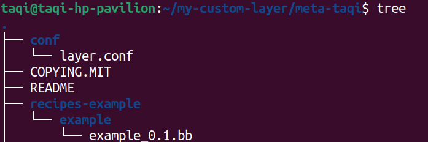
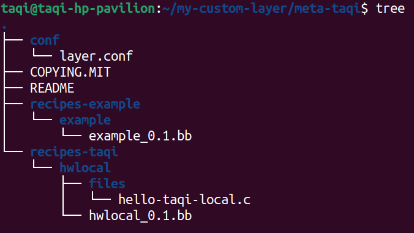

# Creating custom layer and recipe 
> Source: https://kickstartembedded.com/2022/01/21/yocto-part-6-understanding-and-creating-your-first-custom-recipe/

> Source: https://kickstartembedded.com/2022/01/19/yocto-part-5-creating-adding-a-new-layer-to-your-image/

## 1- Make Custom layer
To get started you will need to use the following command to initialise the layer you want
```bash
bitbake-layers create-layer meta-taqi
```
> It is common practice to put the layers inside a yocto directory. 



You will see that bitbake has created a starting directories and example to get started.

- The `conf/` will contain info about the layer for the bitbake to parse
	```r
	# We have a conf and classes directory, add to BBPATH
	BBPATH .= ":${LAYERDIR}"

	# We have recipes-* directories, add to BBFILES
	BBFILES += "${LAYERDIR}/recipes-*/*/*.bb \
				${LAYERDIR}/recipes-*/*/*.bbappend"

	BBFILE_COLLECTIONS += "meta-taqi"
	BBFILE_PATTERN_meta-taqi = "^${LAYERDIR}/"
	BBFILE_PRIORITY_meta-taqi = "6"

	LAYERDEPENDS_meta-taqi = "core"
	LAYERSERIES_COMPAT_meta-taqi = "dunfell"
	```
- the `recipes-example` contains a simple working example for you to try
	```r
	# example_0.1.bb
	SUMMARY = "bitbake-layers recipe"
	DESCRIPTION = "Recipe created by bitbake-layers"
	LICENSE = "MIT"

	python do_display_banner() {
		bb.plain("***********************************************");
		bb.plain("*                                             *");
		bb.plain("*  Example recipe created by bitbake-layers   *");
		bb.plain("*                                             *");
		bb.plain("***********************************************");
	}

	addtask display_banner before do_build

	```
The naming convention for recipes is `name_major.minor.bb`. 

## 2- Make a custom recipe

>The naming convention of the recipe dir is `recipes-name`

### skeleton recipe
```r
# A common variables used in recipes 
DESCRIPTION = "This is a short description of the recipe"
HOMEPAGE = "You can specify your home page "
LICENSE = "Type of license. Eg: GPLv2, MIT, etc."
SECTION = "Useful if package management is required - can omit"
DEPENDS = "Specify the recipes on which your recipe depends"
LIC_FILES_CHKSUM = "md5sum or sha256sum of the license"

SRC_URI = "Where to get the source code from"
```

**The following is a simple structure for creating your own recipe**




---
### My custom recipe
```bash
DESCRIPTION = "This is a simple Hello World recipe - uses a local source file"
LICENSE = "MIT"
LIC_FILES_CHKSUM = "file://${COMMON_LICENSE_DIR}/MIT;md5=b97a012949927931feb7793eee5ed924"

SRC_URI = "file://hello-taqi-local.c"

S = "${WORKDIR}"

do_compile() {
	${CC} ${LDFLAGS} hello-taqi-local.c -o hello-taqi-local
}

do_install() {
	install -d ${D}${bindir}
	install -m 0755 hello-taqi-local ${D}${bindir}
}

```
> By default, bitbake will look at the files folder for this file. Notice how we have referred to file path as file:// to indicate that it is a local resource.

> The environment variable named bindir expands as /bin and the environment variable named D points to the path of the target machine’s image.

```bash
# Generate the checksum for your recipe 
# Put the checksum in LIC_FILES_CHKSUM
md5sum layers/local/recipes-local/my-app/LICENSE
```

**NOTE:** The output of the custom recipe will be in `/home/taqi/yocto_outputs/tmp/work/aarch64-poky-linux/hwlocal/0.1-r0/image/usr/bin/` in my case
