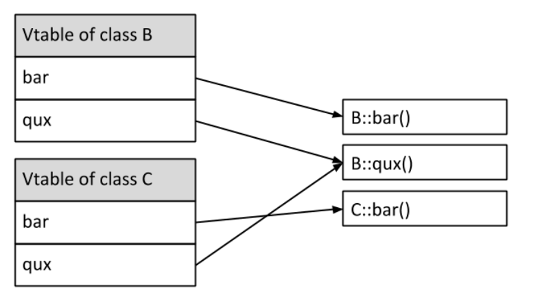

# Polymorphism

### Vtable & vpointer

When having inheritance the compiler wont know which function to call if we override

> Source: https://pabloariasal.github.io/2017/06/10/understanding-virtual-tables/



``` c++
#include <iostream>

class B
{
public:
  virtual void bar();
  virtual void qux();
};

void B::bar()
{
  std::cout << "This is B's implementation of bar" << std::endl;
}

void B::qux()
{
  std::cout << "This is B's implementation of qux" << std::endl;
}

```

```c++
class C : public B
{
public:
  void bar() override;
};

void C::bar()
{
  std::cout << "This is C's implementation of bar" << std::endl;
}


void main() {
    B* b = new C();
    b->bar();
}
```

If we use static dispatch as above, the call b->bar() would execute B::bar(), since (from the point of view of the compiler) b points to an object of type B. This would be horribly wrong, off course, because b actually points to an object of type C and C::bar() should be called instead.


### vpointer


Every time the compiler creates a vtable for a class, it adds an extra argument to it: a pointer to the corresponding virtual table, called the vpointer.

> Note that the vpointer is just another class member added by the compiler and increases the size of every object that has a vtable by sizeof(vpointer).

### Virtual destructor

```c++
#include <iostream>

class Base
{
public:
  ~Base()
  {
    std::cout << "Destroying base" << std::endl;
  }
};

class Derived : public Base
{
public:
  Derived(int number)
  {
    some_resource_ = new int(number);
  }

  ~Derived()
  {
    std::cout << "Destroying derived" << std::endl;
    delete some_resource_;
  }

private:
  int* some_resource_;
};

int main()
{
  Base* p = new Derived(5);
  delete p;
}

```
> Output will be: Destroying base

Making Base’s destructor virtual will result in the expected behavior:
> Destroying derived 
> Destroying base


### pure virtual functions

```c++
/* A function that must be implemented by the derived class*/
virtual void foo(void) = 0;
```
---

### `final` specifier

- final with class prevent inhertitance
- final with functions prevent override

---

### Templates

``` c++
#include <iostream>

// Template function to find the maximum of two values
template <typename T>
T max(T a, T b) {
  return (a > b) ? a : b;
}

int main() {
  int intMax = max<int>(5, 10);
  std::cout << "Maximum of 5 and 10 is: " << intMax << std::endl;

  double doubleMax = max<double>(3.14, 2.71);
  std::cout << "Maximum of 3.14 and 2.71 is: " << doubleMax << std::endl;

  return 0;
}
```

#### Explicitly instantiated 

``` c++
// Declaration of the template function
template <typename T>
T max(T a, T b){
  std::cout << "Template Called\n";
  return (a > b) ? a : b;
}

// Definitions of specific instantiations
template
int max<int>(int a, int b);

int main() {
  int intMax = max<int>(5, 10);
  std::cout << "Maximum of 5 and 10 is: " << intMax << std::endl;

  return 0;
}
```

#### Explicit specialization

``` c++
// Explicit specialization for int
template <>
int max<int>(int a, int b) {
  std::cout << "Explicit specialization for int\n";
  return (a > b) ? a : b;
}
```

# Smart Pointers  

1. `unique_ptr:` This is a smart pointer that owns and manages another object through a pointer and disposes of that object when the unique_ptr goes out of scope. No two unique_ptr instances can manage the same object.

2. `shared_ptr:` This type of smart pointer stores a pointer to a dynamically allocated object. The object is deleted when the last shared_ptr pointing to it is destroyed or reset.

3. `weak_ptr:` This is a smart pointer that holds a non-owning ("weak") reference to an object that is managed by shared_ptr. It must be converted to shared_ptr in order to access the object.

A circular reference occurs when two or more objects refer to each other, causing an infinite loop of references. If `std::shared_ptr` is used in such a scenario, the reference count will never reach zero and the memory will not be freed, leading to a memory leak.

### Circular Reference Problem

``` c++
#include <iostream>
#include <memory>

class B; // Forward declaration

class A {
public:
    std::shared_ptr<B> b_ptr;
    ~A() { std::cout << "A destructor" << std::endl; }
};

class B {
public:
    std::weak_ptr<A> a_ptr; // Use weak_ptr to break the circular reference
    ~B() { std::cout << "B destructor" << std::endl; }
};

int main() {
    std::shared_ptr<A> a = std::make_shared<A>();
    std::shared_ptr<B> b = std::make_shared<B>();
    a->b_ptr = b;
    b->a_ptr = a;

    return 0;
}
```

In this example, A has a shared_ptr to B, and B has a weak_ptr to A. When a and b go out of scope at the end of main, the destructors for A and B are called, and the memory is correctly freed. If B had a shared_ptr to A instead of a weak_ptr, the destructors would not be called and the memory would not be freed, leading to a memory leak.


# Design Patterns

> Source: https://refactoring.guru/design-patterns

